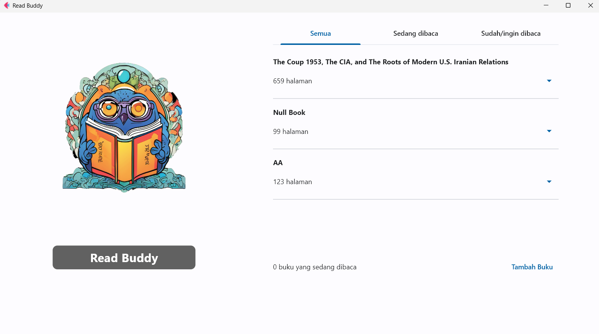
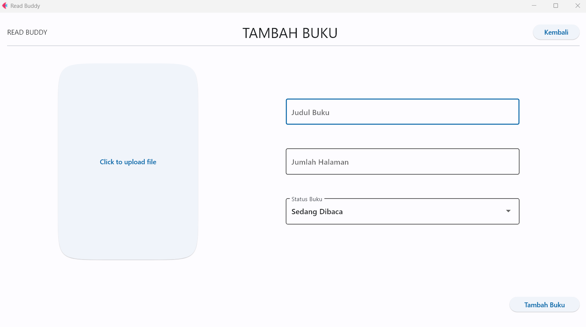
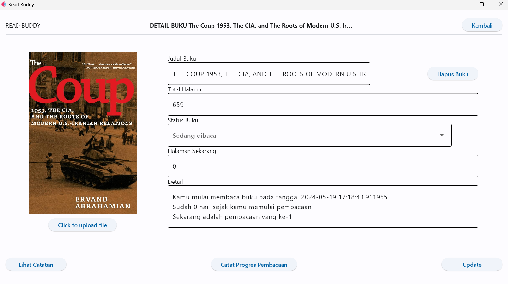
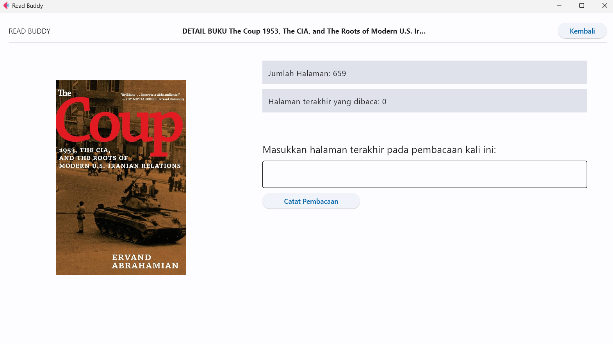
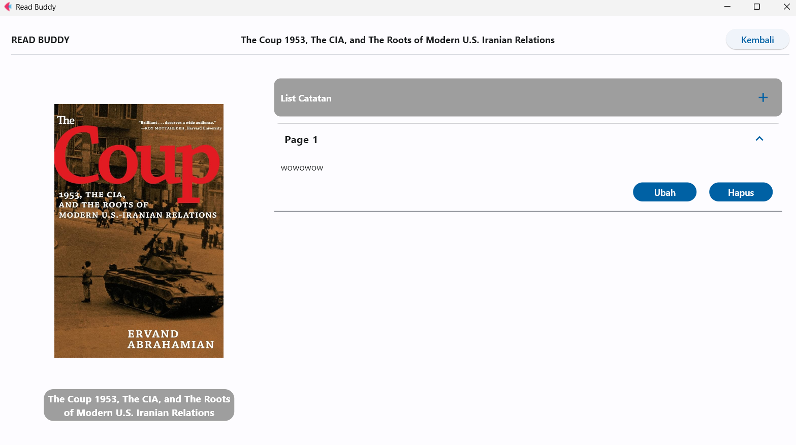
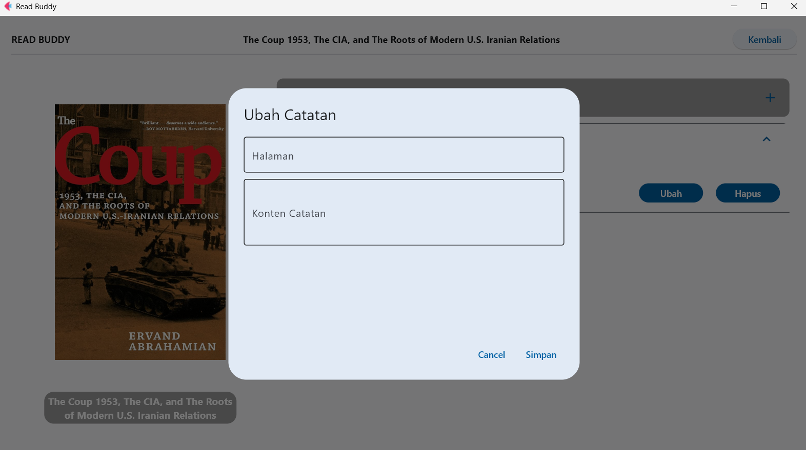

# IF2250-2024-K01-04-Read Buddy


## Deskripsi Aplikasi

Read Buddy adalah sebuah aplikasi reading tracker yang memberikan kemudahan untuk penggunanya dalam mencatat buku bacaan. Read Buddy beroperasi secara luring di platform desktop serta tanpa autentikasi. Pengguna dapat menyimpan data buku-buku yang ingin dibaca dan sedang dibaca serta mencatat nomor halaman terakhir yang telah dibaca pada buku tersebut. Kemudian, dari data-data tersebut program dapat menampilkan informasi tanggal mulai membaca, jumlah hari sejak mulai membaca, dan kali pembacaan. Pengguna juga dapat menambahkan catatan pribadi pada halaman buku yang telah disimpan dalam program.

## Cara Menjalankan Aplikasi
- Pastikan Python sudah terinstall di perangkat anda atau unduh python pada tautan [ini](https://www.python.org/downloads/) dan ikuti langkah instalasinya

- Clone dan buka folder repository

- Install requirements dengan menjalankan command dibawah
```
pip install -r requirements.txt
```

- Jalankan program
```
flet run src/gui/main.py
```
## Modul
- Modul Lihat Data Buku


Diimplementasikan oleh Rayendra Althaf Taraka Noor

- Modul Tambah Buku

Diimplementasikan oleh Abdul Rafi Radityo Hutomo

- Modul Ubah Data Buku

Diimplementasikan oleh Abdullah Mubarak

- Modul Ubah Data Progress Pembacaan

Diimplementasikan oleh Azmi Mahmud Bazeid

- Modul Lihat Catatan

Diimplementasikan oleh Rayhan Fadhlan Azka

- Modul Ubah data Catatan

Diimplementasikan oleh Rayhan Fadhlan Azka

## Daftar Tabel Basis Data
- Buku

|Atribut|Tipe Data|
|---|---|
|id_buku|INT|
|judul_buku|TEXT|
|status_buku|TEXT|
|total_halaman|INT|

- Progres Baca

|Atribut|Tipe Data|
|---|---|
|id_buku|INT|
|pembacaan_ke|INT|
|halaman_terakhir|INT|
|tanggal_mulai|DATE|

- Catatan

|Atribut|Tipe Data|
|---|---|
|id_catatan|INT|
|id_buku|INT|
|halaman_buku|INT|
|konten_catatan|VARCHAR(1000)|