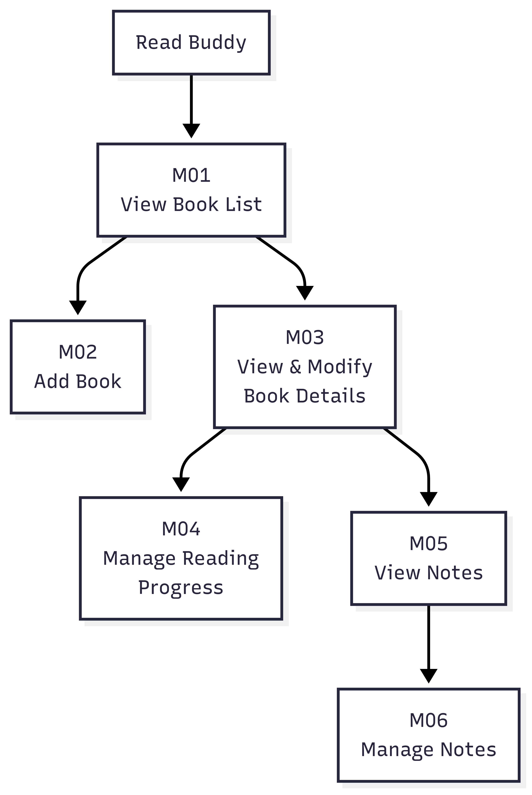
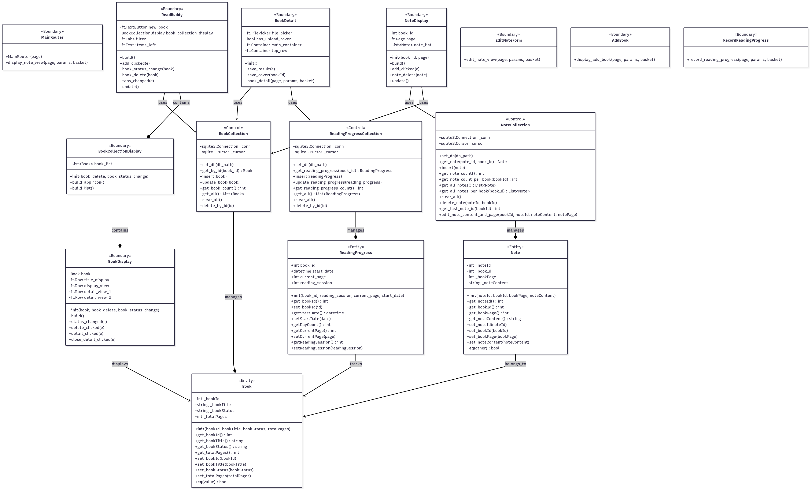
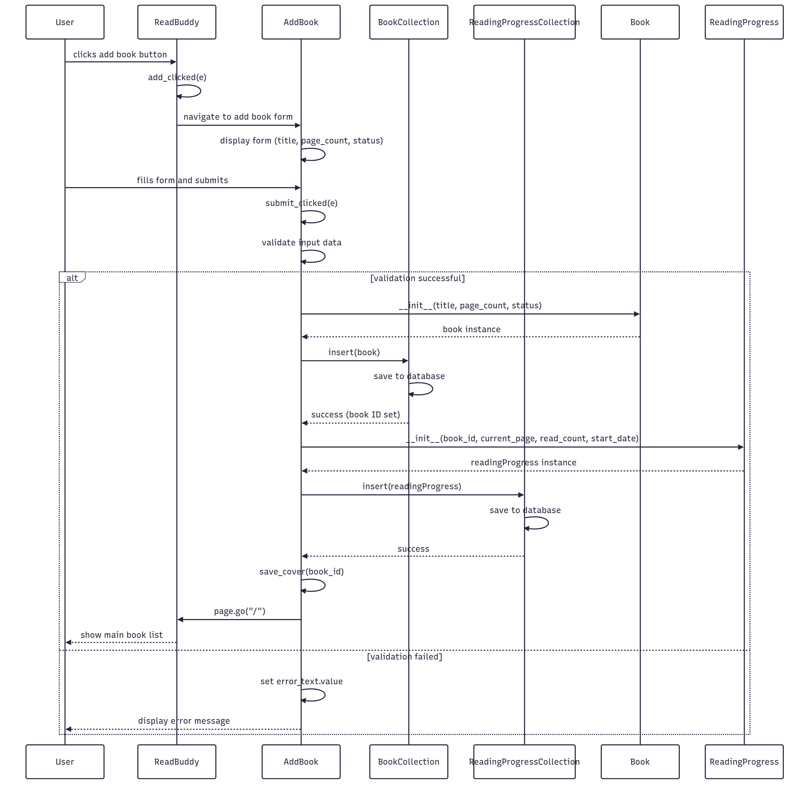
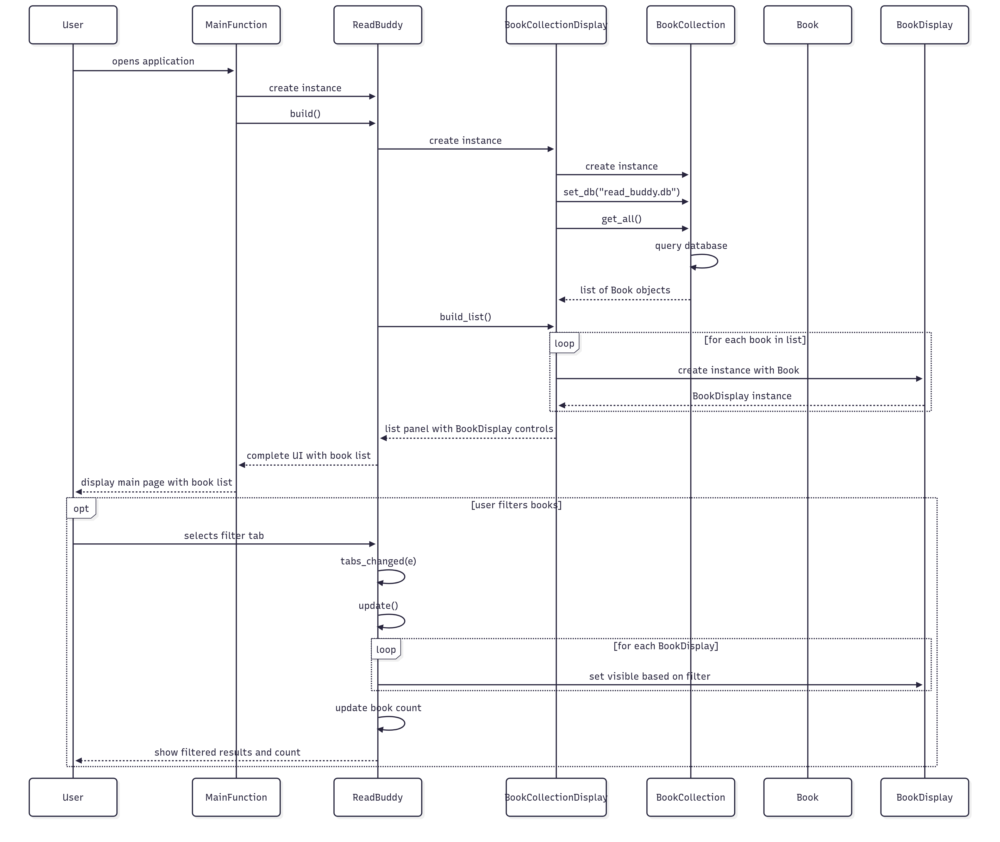
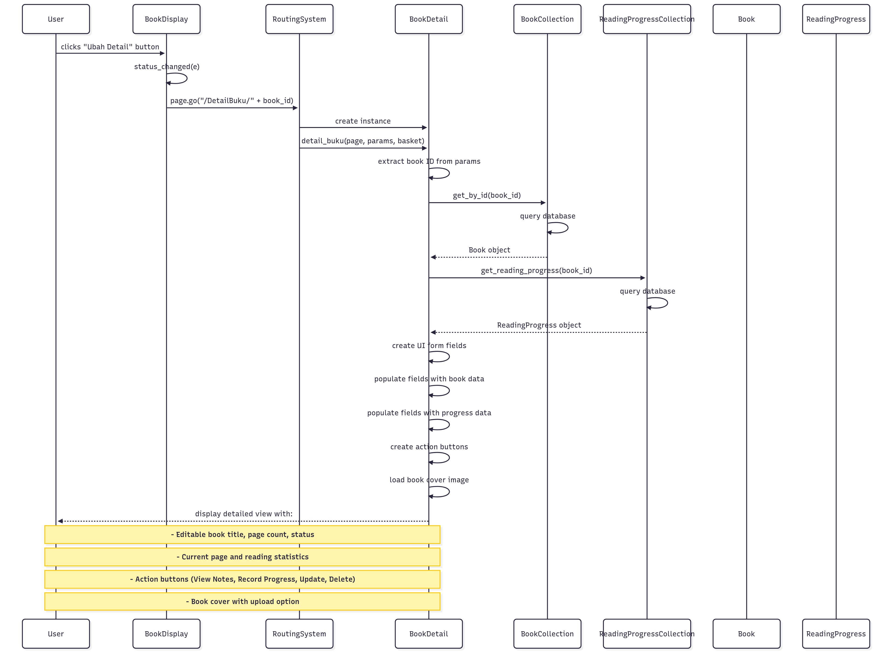
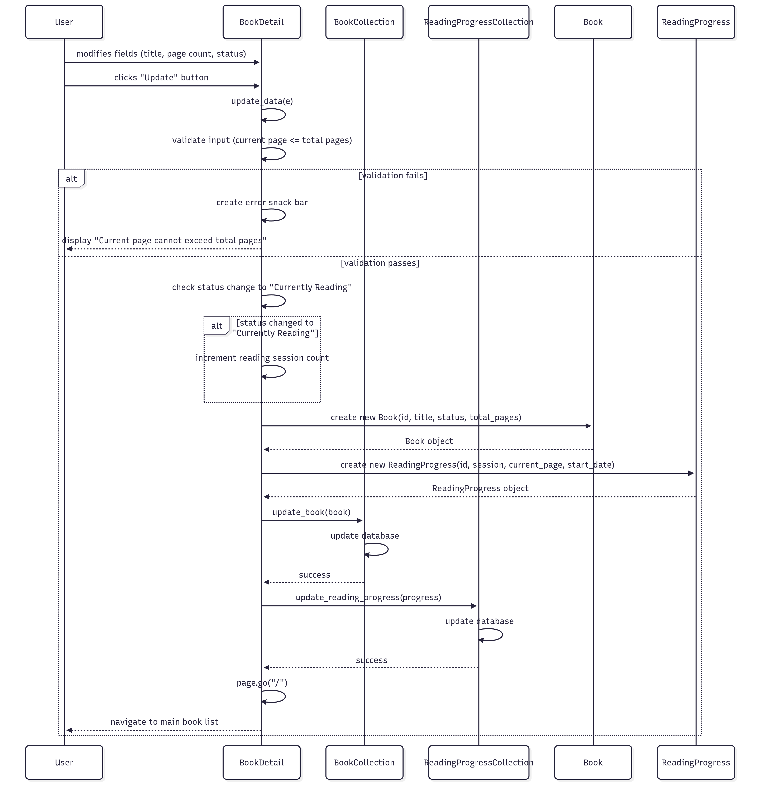
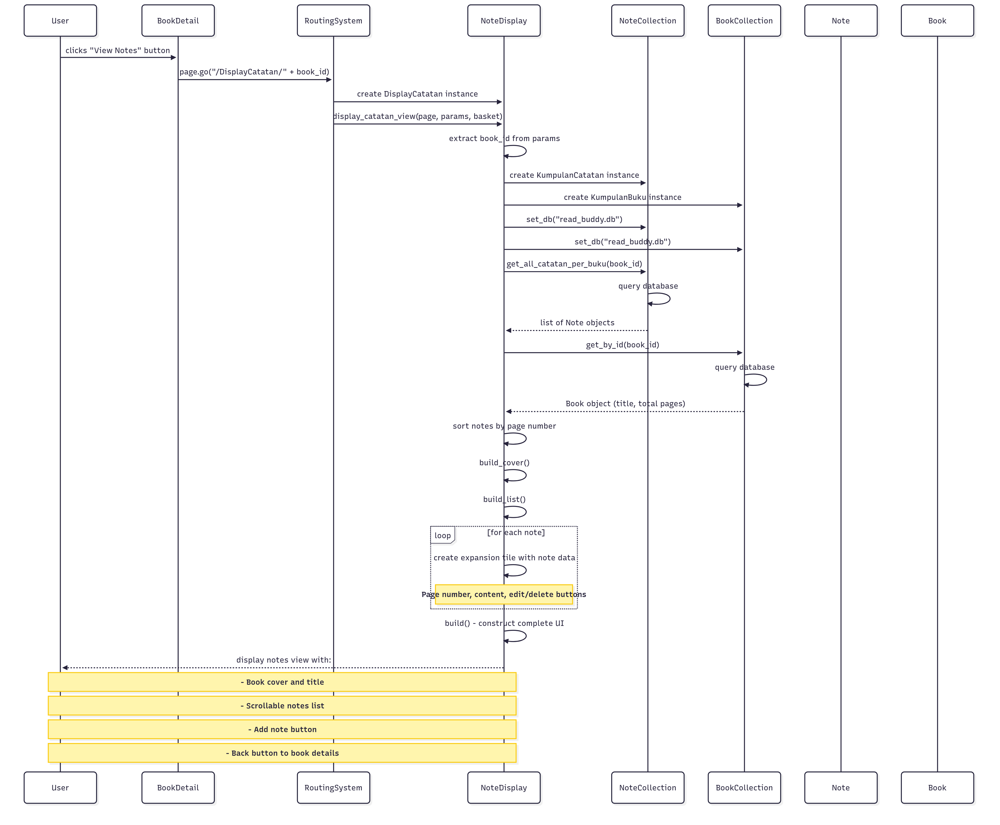
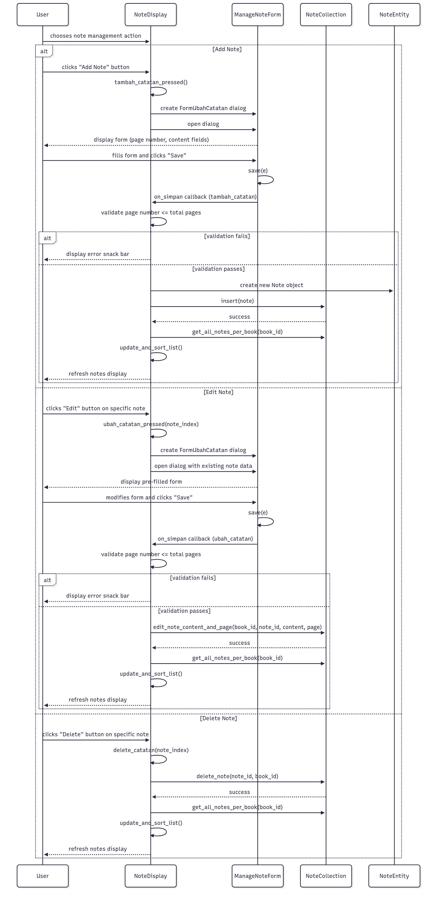

# Software Design Document for Read Buddy

## 1. Introduction

### 1.1 Purpose of the Document

This Software Design Document (SDD) serves as a technical guide for developers in building the Read Buddy software. This document provides a detailed overview of the software's design. Furthermore, this SDD is used to ensure that the functions and structure being developed meet the specifications outlined in the Software Requirements Specification (SRS).

### 1.2 Scope of the Problem

Read Buddy is a reading tracker application designed to help users easily log their reading activities. It operates offline on desktop platforms and does not require user authentication. Users can save data for books they are currently reading or plan to read, track their progress by page number, and view statistics like the start date and duration of their reading. The application also allows users to add, view, and manage personal notes for each book.

### 1.3 Definitions and Terms

| Abbreviation, Acronym, or Term | Explanation                                                                         |
| :----------------------------- | :---------------------------------------------------------------------------------- |
| SDD                            | Software Design Document                                                            |
| DFD                            | Data Flow Diagram is a diagram that shows the flow of data.                         |
| ERD                            | Entity Relationship Diagram is a diagram that shows relationships between entities. |
| OO                             | Object-Oriented is a term to describe the object-based programming paradigm.        |

### 1.4 Naming and Numbering Conventions

| Item / Section         | Numbering | Description                 |
| :--------------------- | :-------- | :-------------------------- |
| Module                 | MXX       | XX starts from 01, 02, etc. |
| Functional Requirement | FXX       | XX starts from 01, 02, etc. |

### 1.5 References

- IEEE. 1998. _IEEE Recommended Practice for Software Requirement Specification_. New York: IEEE Pressman, Roger S. 2001.
- _Software engineering: a practitioner's approach 5th ed_. New York: McGraw-Hill Companies, Inc.
- Software Requirements Specification for Read Buddy

### 1.6 Document Overview

This SDD is divided into six main sections:

1.  **Chapter 1 Introduction:** Outlines the document's purpose, scope, definitions, numbering rules, and references.
2.  **Chapter 2 Overall Design Description:** Describes the implementation environment, architectural design, and software components.
3.  **Chapter 3 Overall Class Diagram:** Presents the complete class diagram with its attributes and methods.
4.  **Chapter 4 Detailed Class Design:** Provides detailed descriptions of each class used in the design.
5.  **Chapter 5 Detailed Design Description:** Details the database schema and the realization of use cases through interaction diagrams and module specifications.
6.  **Chapter 6 Traceability Matrix:** Maps requirements to software modules and use cases to design classes.

---

## 2. Overall Design Description

### 2.1 Design Implementation Environment

The software is designed to operate within the following environment:

- **Operating System (OS):** Windows, with a minimum specification of Windows 10.
- **DBMS:** SQLite
- **Programming Language:** Python
- **Development Tools:** Git, GitHub

### 2.2 Component Description

This structure chart shows the calling relationships between the six modules in Read Buddy:

- Primary Navigation Hub: M01 (View Book List) serves as the main entry point, providing direct access to M02 (Add Book) and M03 (View & Modify Book Details).
- Secondary Navigation Hub: M03 acts as a gateway to detailed book operations, connecting to three specialized modules: M04 (Manage Reading Progress), M05 (View Notes), and M06 (Manage Notes).
- Note Management Flow: M05 and M06 are linked, allowing users to view notes and then edit them through a direct navigation path.
- Hierarchical Pattern: The structure follows a two-level hierarchy where general functions (M01, M02, M03) are at the top level, and specific data management functions (M04, M05, M06) are accessed through the book details interface.

| Module ID | Component Name             | Description                                                                            |
| :-------- | :------------------------- | :------------------------------------------------------------------------------------- |
| M01       | View Book List             | Displays the main screen containing the list of books and their primary status.        |
| M02       | Add Book                   | Displays the form for adding a new book and processes the input to create a new entry. |
| M03       | View & Modify Book Details | Displays the detailed view of a book and its progress, allowing for modifications.     |
| M04       | Manage Reading Progress    | Allows the user to update their reading progress for a specific book.                  |
| M05       | View Notes                 | Displays a list of all notes associated with a specific book.                          |
| M06       | Manage Notes               | Displays the form for adding or editing a note and processes the input.                |
| M07       | Export Notes               | Allows users to export notes for a book to a Markdown file.                            |

---

## 3. Overall Class Diagram

The application's architecture is designed using a clear separation of concerns, categorized into **Entity**, **Control**, and **Boundary** classes.

- **Entity Classes** (`Book`, `Note`, `ReadingProgress`): These classes are the data models, representing the core objects of the application. `Book` holds fundamental information like title and page count. `ReadingProgress` tracks the user's progress for a specific book, while `Note` stores user-created annotations. `ReadingProgress` and `Note` are both intrinsically linked to a `Book`.

- **Control Classes** (`BookCollection`, `NoteCollection`, `ReadingProgressCollection`): These classes act as a data access layer and controller. They manage all interactions with the SQLite database, handling the logic for creating, retrieving, updating, and deleting records. Each collection class is responsible for managing its corresponding entity type (e.g., `BookCollection` manages `Book` objects). This layer isolates the rest of the application from the specifics of the database implementation.

- **Boundary Classes** (`MainRouter`, `ReadBuddy`, `BookDisplay`, etc.): These classes constitute the user interface (View) layer. They are responsible for rendering the application's windows, forms, and data displays. They do not contain business logic but instead delegate user actions to the appropriate **Control** classes. For example, when a user clicks "Add Book" in the `ReadBuddy` view, the action is passed to the `BookCollection` to create a new record. The Boundary classes then receive data back from the Control classes to display to the user. `MainRouter` handles navigation between different views.

## 4. Detailed Class Design

This section provides a detailed breakdown of each class based on class diagram above.

### 4.1 Entity Classes

#### 4.1.1 Class: Book

**Class Name**: `Book`

| Operation Name               | Visibility     | Description                                  |
| :--------------------------- | :------------- | :------------------------------------------- |
| `__init__(...)`              | public         | Constructor to initialize a new Book object. |
| `get_bookId()`               | public         | Returns the unique identifier for the book.  |
| `get_bookTitle()`            | public         | Returns the title of the book.               |
| `get_bookStatus()`           | public         | Returns the current reading status.          |
| `get_totalPages()`           | public         | Returns the total number of pages.           |
| `set_bookId(bookId)`         | public         | Sets the book's identifier.                  |
| `set_bookTitle(bookTitle)`   | public         | Sets a new title for the book.               |
| `set_bookStatus(bookStatus)` | public         | Sets a new reading status for the book.      |
| `set_totalPages(totalPages)` | public         | Sets a new page count for the book.          |
| `__eq__(value)`              | public         | Compares two Book objects for equality.      |
| `get_isFavorite()`           | public         | Returns the favorite status of the book.     |
| `set_isFavorite(isFavorite)` | public         | Sets the favorite status of the book.        |
| **Attribute Name**           | **Visibility** | **Type**                                     |
| `_bookId`                    | private        | Integer                                      |
| `_bookTitle`                 | private        | String                                       |
| `_bookStatus`                | private        | String                                       |
| `_totalPages`                | private        | Integer                                      |
| `_isFavorite`                | private        | Boolean                                      |

#### 4.1.2 Class: Note

**Class Name**: `Note`

| Operation Name                 | Visibility     | Description                                  |
| :----------------------------- | :------------- | :------------------------------------------- |
| `__init__(...)`                | public         | Constructor to initialize a new Note object. |
| `get_noteId()`                 | public         | Returns the unique identifier for the note.  |
| `get_bookId()`                 | public         | Returns the ID of the associated book.       |
| `get_bookPage()`               | public         | Returns the page number for the note.        |
| `get_noteContent()`            | public         | Returns the text content of the note.        |
| `set_noteId(noteId)`           | public         | Sets the note's identifier.                  |
| `set_bookId(bookId)`           | public         | Sets the associated book's identifier.       |
| `set_bookPage(bookPage)`       | public         | Sets the page number for the note.           |
| `set_noteContent(noteContent)` | public         | Sets new text content for the note.          |
| `__eq__(other)`                | public         | Compares two Note objects for equality.      |
| **Attribute Name**             | **Visibility** | **Type**                                     |
| `_noteId`                      | private        | Integer                                      |
| `_bookId`                      | private        | Integer                                      |
| `_bookPage`                    | private        | Integer                                      |
| `_noteContent`                 | private        | String                                       |

#### 4.1.3 Class: ReadingProgress

**Class Name**: `ReadingProgress`

| Operation Name               | Visibility     | Description                                               |
| :--------------------------- | :------------- | :-------------------------------------------------------- |
| `__init__(...)`              | public         | Constructor to initialize a new ReadingProgress object.   |
| `get_bookId()`               | public         | Returns the ID of the associated book.                    |
| `set_bookId(id)`             | public         | Sets the associated book's identifier.                    |
| `getStartDate()`             | public         | Returns the date the user started reading.                |
| `setStartDate(date)`         | public         | Sets the reading start date.                              |
| `getDayCount()`              | public         | Calculates and returns the number of days since starting. |
| `getCurrentPage()`           | public         | Returns the last read page number.                        |
| `setCurrentPage(page)`       | public         | Sets the current page number.                             |
| `getReadingSession()`        | public         | Returns how many times the book has been read.            |
| `setReadingSession(session)` | public         | Sets the number of times the book has been read.          |
| **Attribute Name**           | **Visibility** | **Type**                                                  |
| `book_id`                    | public         | Integer                                                   |
| `start_date`                 | public         | Datetime                                                  |
| `current_page`               | public         | Integer                                                   |
| `reading_session`            | public         | Integer                                                   |

---

### 4.2 Control Classes

#### 4.2.1 Class: BookCollection

**Class Name**: `BookCollection`

| Operation Name                                 | Visibility     | Description                                                                 |
| :--------------------------------------------- | :------------- | :-------------------------------------------------------------------------- |
| `set_db(db_path)`                              | public         | Sets up the database connection.                                            |
| `get_by_id(book_id)`                           | public         | Retrieves a single `Book` object by its ID.                                 |
| `get_book_count()`                             | public         | Returns the total number of books.                                          |
| `get_all()`                                    | public         | Retrieves a list of all book records.                                       |
| `clear_all()`                                  | public         | Deletes all book records from the database.                                 |
| `delete_by_id(id)`                             | public         | Deletes a book record by its ID.                                            |
| `insert(book)`                                 | public         | Inserts a new book record into the database, including favorite status.     |
| `update_book(book)`                            | public         | Updates an existing book record in the database, including favorite status. |
| `update_favorite_status(book_id, is_favorite)` | public         | Updates the favorite status of a book in the database.                      |
| `get_favorites()`                              | public         | Retrieves a list of favorite book records.                                  |
| **Attribute Name**                             | **Visibility** | **Type**                                                                    |
| `_conn`                                        | private        | sqlite3.Connection                                                          |
| `_cursor`                                      | private        | sqlite3.Cursor                                                              |

#### 4.2.2 Class: NoteCollection

**Class Name**: `NoteCollection`

| Operation Name                    | Visibility     | Description                                                  |
| :-------------------------------- | :------------- | :----------------------------------------------------------- |
| `set_db(db_path)`                 | public         | Sets up the database connection.                             |
| `get_note(note_id, book_id)`      | public         | Retrieves a single `Note` object.                            |
| `insert(note)`                    | public         | Inserts a new note record into the database.                 |
| `get_note_count()`                | public         | Returns the total number of notes across all books.          |
| `get_note_count_per_book(bookId)` | public         | Returns the number of notes for a specific book.             |
| `get_all_notes()`                 | public         | Retrieves a list of all note records.                        |
| `get_all_notes_per_book(bookId)`  | public         | Retrieves a list of all notes for a specific book.           |
| `clear_all()`                     | public         | Deletes all note records from the database.                  |
| `delete_note(noteId, bookId)`     | public         | Deletes a specific note record.                              |
| `get_last_note_id(bookId)`        | public         | Retrieves the ID of the most recently added note for a book. |
| `edit_note_content_and_page(...)` | public         | Updates the content and page number of a specific note.      |
| **Attribute Name**                | **Visibility** | **Type**                                                     |
| `_conn`                           | private        | sqlite3.Connection                                           |
| `_cursor`                         | private        | sqlite3.Cursor                                               |

#### 4.2.3 Class: ReadingProgressCollection

**Class Name**: `ReadingProgressCollection`

| Operation Name                      | Visibility     | Description                                                  |
| :---------------------------------- | :------------- | :----------------------------------------------------------- |
| `set_db(db_path)`                   | public         | Sets up the database connection.                             |
| `get_reading_progress(book_id)`     | public         | Retrieves the `ReadingProgress` object for a specific book.  |
| `insert(readingProgress)`           | public         | Inserts a new reading progress record into the database.     |
| `update_reading_progress(progress)` | public         | Updates an existing reading progress record in the database. |
| `get_reading_progress_count()`      | public         | Returns the total number of reading progress records.        |
| `get_all()`                         | public         | Retrieves a list of all reading progress records.            |
| `clear_all()`                       | public         | Deletes all reading progress records from the database.      |
| `delete_by_id(id)`                  | public         | Deletes a reading progress record by its associated book ID. |
| **Attribute Name**                  | **Visibility** | **Type**                                                     |
| `_conn`                             | private        | sqlite3.Connection                                           |
| `_cursor`                           | private        | sqlite3.Cursor                                               |

---

### 4.3 Boundary Classes

_Note: For UI classes, methods often correspond to building UI components or handling user events. Attributes are typically UI widgets._

#### 4.3.1 Class: MainRouter

**Class Name**: `MainRouter`

| Operation Name              | Visibility     | Description                              |
| :-------------------------- | :------------- | :--------------------------------------- |
| `MainRouter(page)`          | public         | Constructor to initialize the router.    |
| `display_note_view(...)`    | public         | Navigates to and displays the note view. |
| **Attribute Name**          | **Visibility** | **Type**                                 |
| _(No attributes specified)_ | -              | -                                        |

#### 4.3.2 Class: ReadBuddy

**Class Name**: `ReadBuddy`

| Operation Name               | Visibility     | Description                                                      |
| :--------------------------- | :------------- | :--------------------------------------------------------------- |
| `build()`                    | public         | Constructs the main application UI.                              |
| `add_clicked(e)`             | public         | Event handler for when the 'add book' button is clicked.         |
| `book_status_change(book)`   | public         | Callback function to handle a change in a book's status.         |
| `book_delete(book)`          | public         | Callback function to handle the deletion of a book.              |
| `tabs_changed(e)`            | public         | Event handler for when the filter tabs are changed.              |
| `update()`                   | public         | Refreshes the main view.                                         |
| `book_favorite_change(book)` | public         | Callback function to handle changes in a book's favorite status. |
| **Attribute Name**           | **Visibility** | **Type**                                                         |
| `new_book`                   | private        | ft.TextButton                                                    |
| `book_collection_display`    | private        | BookCollectionDisplay                                            |
| `filter`                     | private        | ft.Tabs                                                          |
| `items_left`                 | private        | ft.Text                                                          |

#### 4.3.3 Class: BookDisplay

**Class Name**: `BookDisplay`

| Operation Name            | Visibility     | Description                                                   |
| :------------------------ | :------------- | :------------------------------------------------------------ |
| `__init__(...)`           | public         | Constructor to initialize the display for a single book.      |
| `build()`                 | public         | Constructs the UI for a single book entry.                    |
| `status_changed(e)`       | public         | Event handler for when the book's status checkbox is changed. |
| `delete_clicked(e)`       | public         | Event handler for when the delete button is clicked.          |
| `detail_clicked(e)`       | public         | Event handler for when the user clicks to see book details.   |
| `close_detail_clicked(e)` | public         | Event handler for when the user closes the detail view.       |
| `favorite_clicked(e)`     | public         | Event handler for when the favorite button is clicked.        |
| export_action(e)          | public         | Exports all notes for the book to a Markdown file.            |
| **Attribute Name**        | **Visibility** | **Type**                                                      |
| `book`                    | private        | Book                                                          |
| `title_display`           | private        | ft.Row                                                        |
| `display_view`            | private        | ft.Row                                                        |
| `detail_view_1`           | private        | ft.Row                                                        |
| `detail_view_2`           | private        | ft.Row                                                        |
| note_collection           | private        | NoteCollection                                                |

#### 4.3.4 Other Boundary Classes

- **BookDetail**: Manages the detailed view of a book, including data retrieval, updates, and favorite status toggling.
- **BookCollectionDisplay**: Builds the UI for displaying the collection of books, including favorite filtering and icons.
- **AddBook**: Displays the form for adding a new book, including favorite status initialization, and handles input validation and saving.
- **NoteDisplay**: Builds the UI to display all notes for a specific book and handles add/delete events.
- **EditNoteForm**: A view/function to display the form for editing an existing note.
- **RecordReadingProgress**: A view/function to display the form for updating reading progress.

---

## 5. Detailed Design Description

### 5.1 Database Schema

The software will use a local SQLite database with the following tables to persist data.

**Table 1: Books**

- **Description:** Stores the primary information for each book.
- **Primary Key:** `book_id`

| Field Name    | Data Type | Constraints                |
| :------------ | :-------- | :------------------------- |
| `book_id`     | INTEGER   | PRIMARY KEY, AUTOINCREMENT |
| `title`       | TEXT      | NOT NULL                   |
| `page_count`  | INTEGER   | NOT NULL                   |
| `status`      | TEXT      | NOT NULL                   |
| `is_favorite` | INTEGER   | DEFAULT 0                  |

**Table 2: ReadingProgress**

- **Description:** Stores the reading progress associated with each book.
- **Primary Key:** `progress_id`

| Field Name     | Data Type | Constraints                          |
| :------------- | :-------- | :----------------------------------- |
| `progress_id`  | INTEGER   | PRIMARY KEY, AUTOINCREMENT           |
| `book_id`      | INTEGER   | NOT NULL, FOREIGN KEY(books.book_id) |
| `start_date`   | TEXT      |                                      |
| `current_page` | INTEGER   |                                      |
| `read_count`   | INTEGER   |                                      |

**Table 3: Notes**

- **Description:** Stores user-created notes for each book.
- **Primary Key:** `note_id`

| Field Name    | Data Type | Constraints                          |
| :------------ | :-------- | :----------------------------------- |
| `note_id`     | INTEGER   | PRIMARY KEY, AUTOINCREMENT           |
| `book_id`     | INTEGER   | NOT NULL, FOREIGN KEY(books.book_id) |
| `page_number` | INTEGER   | NOT NULL                             |
| `content`     | TEXT      |                                      |

### 5.2 Use Case Realization

**UC01: Add book**

1.  The User interacts with `ReadBuddy` and clicks the add book button.
2.  `ReadBuddy` navigates to the `AddBook` view.
3.  The User fills the form with book title, page count, and status, then submits.
4.  `AddBook` validates the input data (title not empty, page count is positive integer).
5.  If validation passes, `AddBook` creates a new `Book` instance and calls `insert()` on `BookCollection`.
6.  `BookCollection` saves the book to the database and returns the generated book ID.
7.  `AddBook` creates a `ReadingProgress` instance and calls `insert()` on `ReadingProgressCollection`.
8.  The user is redirected back to the main book list view.
9.  If validation fails, an error message is displayed and the user remains on the form.

**UC02: View list of books**

1.  On application start, the main function creates a `ReadBuddy` instance and calls `build()`.
2.  `ReadBuddy` creates a `BookCollectionDisplay` instance during its initialization.
3.  `BookCollectionDisplay` constructor creates a `BookCollection` instance and calls `get_all()`.
4.  `BookCollection` retrieves all `Book` records from the database and returns them as a list.
5.  `BookCollectionDisplay` stores the book list and creates `BookDisplay` instances for each book when `build_list()` is called.
6.  Each `BookDisplay` renders an individual book item with title, page count, and status.
7.  The user can filter books by status using tabs, which triggers the `update()` method to show/hide books based on the selected filter.
8.  The system displays a count of books currently being read.

**UC03: View book details**

1.  The User selects a book from the list in the `BookDisplay` view, which triggers navigation to the detail page.
2.  The routing system creates a `BookDetail` instance and calls `detail_buku()` with the book ID from URL parameters.
3.  `BookDetail` extracts the book ID from the route parameters.
4.  `BookDetail` calls `get_by_id()` on `BookCollection` to retrieve the specific book data.
5.  `BookDetail` calls `get_reading_progress()` on `ReadingProgressCollection` to retrieve progress data.
6.  `BookCollection` and `ReadingProgressCollection` query the database and return the respective objects.
7.  `BookDetail` constructs the UI with populated form fields showing book title, page count, status, current page, and reading statistics.
8.  The detail view displays action buttons for viewing notes, recording progress, updating data, and deleting the book.
9.  The view shows the book cover image with an option to upload a new cover.
10. If the user clicks the export notes button, `BookDetail` calls `export_action()` to fetch and export notes to a Markdown file.

**UC04: Modify book**

1.  From the `BookDetail` view, the User modifies data in the editable fields (book title, page count, status) and clicks the "Update" button.
2.  `BookDetail` calls the internal `update_data()` function to handle the modification.
3.  `BookDetail` validates the input data (current page must not exceed total pages).
4.  If validation fails, `BookDetail` displays an error snack bar and stops the process.
5.  If validation passes, `BookDetail` checks if the status changed from "Read" or "Want to Read" to "Currently Reading".
6.  If status changed to "Currently Reading", `BookDetail` increments the reading session count.
7.  `BookDetail` creates new `Book` and `ReadingProgress` objects with the updated data.
8.  `BookDetail` calls `update_book()` on `BookCollection` to save the modified book data.
9.  `BookDetail` calls `update_reading_progress()` on `ReadingProgressCollection` to save the progress data.
10. Upon successful update, the user is redirected back to the main book list view.

**UC05: View notes**

1.  From the `BookDetail` view, the User clicks the "View Notes" button.
2.  `BookDetail` navigates to the notes display route with the book ID as a parameter.
3.  The routing system creates a `NoteDisplay` instance and calls `display_catatan_view()` with the book ID.
4.  `NoteDisplay` constructor extracts the book ID and creates `NoteCollection` and `BookCollection` instances.
5.  `NoteDisplay` calls `get_all_notes_per_book()` on `NoteCollection` to retrieve all notes for the specific book.
6.  `NoteDisplay` calls `get_by_id()` on `BookCollection` to retrieve book information (title and total pages).
7.  `NoteCollection` and `BookCollection` query the database and return the respective objects.
8.  `NoteDisplay` sorts the notes by page number for organized display.
9.  `NoteDisplay` constructs the UI showing the book cover, title, and a scrollable list of notes.
10. Each note is displayed in an expandable tile showing page number, content, and action buttons (edit/delete).
11. The view includes an "Add Note" button for creating new notes.

**UC06: Manage notes**

1.  From the `NoteDisplay` view, the User chooses to add, edit, or delete a note.
2.  For adding notes: User clicks the "Add Note" button, which calls `tambah_catatan_pressed()`.
3.  For editing notes: User clicks the "Edit" button on a specific note, which calls `ubah_catatan_pressed()`.
4.  For both add/edit operations: `NoteDisplay` creates and opens a `ManageNoteForm` dialog.
5.  User enters or modifies the note content and page number in the dialog form.
6.  User clicks "Save" in the dialog, which triggers the respective callback function.
7.  `NoteDisplay` validates the page number (must not exceed book's total pages).
8.  If validation fails, an error snack bar is displayed and the process stops.
9.  If validation passes: For new notes, `NoteDisplay` calls `insert()` on `NoteCollection` with a new `Note` object.
10. For edited notes: `NoteDisplay` calls `edit_note_content_and_page()` on `NoteCollection`.
11. For deleting notes: User clicks "Delete" button, which directly calls `delete_note()` on `NoteCollection`.
12. After any modification, `NoteDisplay` refreshes the notes list by calling `get_all_notes_per_book()` and rebuilds the UI.

---

### 5.3 Detailed Module Description

#### 5.3.1 Module: View Book Data

##### 5.3.1.1 Module Function

| No. | Function                                 | Type                   | Related Table |
| :-- | :--------------------------------------- | :--------------------- | :------------ |
| 1   | Display Book Title and its pages         | Report                 | Books         |
| 2   | Display detail book and add book buttons | Form                   |               |
| 3   | Retrieve book data from data store       | Process Without Screen | Books         |

##### 5.3.1.2 Main Screen Specification

_(This section refers to the UI mockup for the main "View Book Data" screen, showing the app logo and a list of books.)_

##### 5.3.1.3 Screen Data Field Specification

| Label       | Field        | Table/Query | Validation           | Description |
| :---------- | :----------- | :---------- | :------------------- | :---------- |
| Book Title  | `title`      | Books       | Book title not empty |             |
| Page Count  | `page_count` | Books       | Page count not 0     |             |
| Book Status | `status`     | Books       |                      |             |

##### 5.3.1.4 On-Screen Object Specification

| Object ID          | Type   | Description                                  |
| :----------------- | :----- | :------------------------------------------- |
| `BookDetailButton` | Button | If clicked, will go to the book detail page. |
| `AddBookButton`    | Button | If clicked, will go to the add book page.    |
| `LogoImage`        | Image  | Associated with the logo image.              |

---

#### 5.3.2 Module: Add Book

##### 5.3.2.1 Module Function

| No. | Function                                         | Type                     | Related Table |
| :-- | :----------------------------------------------- | :----------------------- | :------------ |
| 1   | Display back and add book buttons                | Form                     |               |
| 2   | Display text boxes for book title and page count | Form Entry Master-Detail |               |
| 3   | Display dropdown for book status                 | Form Entry               |               |
| 4   | Validate book title and page count               | Process Without Screen   |               |
| 5   | Save book data information to the data store     | Process Without Screen   | Books         |
| 6   | Display button for image file selection          | Form Entry               |               |

##### 5.3.2.2 Main Screen Specification

_(This section refers to the UI mockup for the "Add Book" screen.)_

##### 5.3.2.3 Screen Data Field Specification

No data fields on the screen.

##### 5.3.2.4 On-Screen Object Specification

| Object ID               | Type              | Description                                                                                     |
| :---------------------- | :---------------- | :---------------------------------------------------------------------------------------------- |
| `BackButton`            | Button            | If clicked, will return to the initial page.                                                    |
| `AddBookButton`         | Button            | If clicked, will run the book data validation process and save the book data to the data store. |
| `ImageUpload`           | Button File Input | If clicked, will ask the user to select a file.                                                 |
| `BookTitleTextField`    | Text Field        | Text Box for book title.                                                                        |
| `PageCountTextField`    | Text Field        | Text Box for book page count.                                                                   |
| `ValidationDataControl` | Data control      | Associated with the query for validating book title and page count data.                        |

---

#### 5.3.3 Module: Modify Book Data

##### 5.3.3.1 Module Function

| No. | Function                                                                             | Type                     | Related Table          |
| :-- | :----------------------------------------------------------------------------------- | :----------------------- | :--------------------- |
| 1   | Display Book Details                                                                 | Report                   | Books, ReadingProgress |
| 2   | Display back, view notes, record progress, and update data buttons                   | Form                     |                        |
| 3   | Display book title and page count fields initially set with values from the database | Form Entry Master-Detail | Books                  |
| 4   | Retrieve book data from the data store                                               | Process Without Screen   | Books                  |
| 5   | Validate book title and page count                                                   | Process Without Screen   |                        |
| 6   | Save book data information to the data store                                         | Process Without Screen   | Books                  |

##### 5.3.3.2 Main Screen Specification

_(This section refers to the UI mockup for the "Modify Book Data" screen, which shows all book details.)_

##### 5.3.3.3 Query Specification

| Query No. | Query                                                                                    | Description                                                                                               |
| :-------- | :--------------------------------------------------------------------------------------- | :-------------------------------------------------------------------------------------------------------- |
| Q1        | `SELECT julianday('now') - julianday(start_date) FROM ReadingProgress WHERE book_id = ?` | Returns the number of days since starting to read by calculating from the start date to the current date. |

##### 5.3.3.4 Screen Data Field Specification

| Label            | Field          | Table/Query     | Validation                                                    | Description |
| :--------------- | :------------- | :-------------- | :------------------------------------------------------------ | :---------- |
| Book Title       | `title`        | Books           | Title does NOT EXIST                                          |             |
| Page Count       | `page_count`   | Books           | Pages > 0                                                     |             |
| Book Status      | `status`       | Books           |                                                               |             |
| Last Page Read   | `current_page` | ReadingProgress | Last page is within a valid range according to the page count |             |
| Reading Date     | `start_date`   | ReadingProgress |                                                               |             |
| Days Since Start | `days_reading` | Q1              |                                                               |             |
| Reading Session  | `read_count`   | ReadingProgress |                                                               |             |

##### 5.3.3.5 On-Screen Object Specification

| Object ID               | Type         | Description                                                                                     |
| :---------------------- | :----------- | :---------------------------------------------------------------------------------------------- |
| `BackButton`            | Button       | If clicked, will return to the initial page.                                                    |
| `DeleteBookButton`      | Button       | If clicked, will delete the book from the database and return to the main page.                 |
| `ViewNotesButton`       | Button       | If clicked, will display the notes screen.                                                      |
| `RecordProgressButton`  | Button       | If clicked, will display the modify reading progress screen.                                    |
| `UpdateBookDataButton`  | Button       | If clicked, will save the content of the book title and page count text fields to the database. |
| `BookTitleTextField`    | Text Field   | Text Box for book title, initially filled with the book's title.                                |
| `PageCountTextField`    | Text Field   | Text Box for page count, initially filled with the book's page count.                           |
| `ValidationDataControl` | Data control | Associated with the query for validating book title and page count data.                        |
| `CoverImage`            | Image        | Associated with the cover image in the Books table.                                             |
| `ExportNotesButton`     | Button       | If clicked, will export the notes for the book to a Markdown file.                              |

---

#### 5.3.4 Module: Modify Reading Progress Data

##### 5.3.4.1 Module Function

| No. | Function                                                                                      | Type                     | Related Table          |
| :-- | :-------------------------------------------------------------------------------------------- | :----------------------- | :--------------------- |
| 1   | Display the modify reading progress data form                                                 | Form Entry master-detail |                        |
| 2   | Validate the reading progress page                                                            | Process without screen   | ReadingProgress, Books |
| 3   | Save the last page information to the data store                                              | Process without screen   | ReadingProgress        |
| 4   | Change book status from "reading" to "read" if the last page read equals the total page count | Process without screen   | ReadingProgress        |
| 5   | Display the title, page count, last page read, and book cover on the screen                   | Report                   |                        |
| 6   | Display the back and record reading buttons                                                   | Form                     |                        |

##### 5.3.4.2 Main Screen Specification

_(This section refers to the UI mockup for the "Record Reading Progress" screen.)_

##### 5.3.4.3 Screen Data Field Specification

| Label          | Field          | Table/Query     | Validation               | Description |
| :------------- | :------------- | :-------------- | :----------------------- | :---------- |
| Book Title     | `title`        | Books           |                          |             |
| Page Count     | `page_count`   | Books           |                          |             |
| Last Page Read | `current_page` | ReadingProgress |                          |             |
| Book Page      | `current_page` | ReadingProgress | LastPageRead < PageCount |             |

##### 5.3.4.4 On-Screen Object Specification

| Object ID               | Type         | Description                                                                        |
| :---------------------- | :----------- | :--------------------------------------------------------------------------------- |
| `BackButton`            | Button       | If clicked, will return to the initial page.                                       |
| `RecordReadingButton`   | Button       | If clicked, will run the validation process and save the last page read.           |
| `LastBookPageTextField` | Text Field   | Text Box containing the last page read for the session being recorded.             |
| `ValidationDataControl` | Data control | Associated with the query for validating last page read and total page count data. |
| `CoverImage`            | Image        | Associated with the cover image in the Books table.                                |

---

#### 5.3.5 Module: View Notes

##### 5.3.5.1 Module Function

| No. | Function                                                                   | Type                   | Related Table |
| :-- | :------------------------------------------------------------------------- | :--------------------- | :------------ |
| 1   | Display back and add note buttons                                          | Form                   |               |
| 2   | Display note page and note content data                                    | Report                 | Notes         |
| 3   | Retrieve note page and content information from the data store             | Process without screen | Notes         |
| 4   | Display a dropdown button on each note entry                               | Form                   |               |
| 5   | Display modify note and delete note buttons when the dropdown is activated | Form                   |               |

##### 5.3.5.2 Main Screen Specification

_(This section refers to the UI mockup for the "View Notes" screen.)_

##### 5.3.5.3 Screen Data Field Specification

| Label        | Field         | Table/Query | Validation                                       | Description |
| :----------- | :------------ | :---------- | :----------------------------------------------- | :---------- |
| Book Title   | `title`       | Books       | Title must be a recorded title.                  |             |
| Note Page    | `page_number` | Notes       | Page is within a valid range for the book title. |             |
| Note Content | `content`     | Notes       | Note content is not empty.                       |             |

##### 5.3.5.4 On-Screen Object Specification

| Object ID          | Type   | Description                                                                        |
| :----------------- | :----- | :--------------------------------------------------------------------------------- |
| `BackButton`       | Button | If clicked, will return to the initial page.                                       |
| `AddNoteButton`    | Button | If clicked, will go to the modify note page with initially empty content.          |
| `UpdateNoteButton` | Button | If clicked, will go to the modify note page with content pre-filled from the note. |
| `DeleteNoteButton` | Button | If clicked, will delete the associated note.                                       |
| `CoverImage`       | Image  | Associated with the cover image in the Books table.                                |

---

#### 5.3.6 Module: Modify Note Data

##### 5.3.6.1 Module Function

| No. | Function                                | Type                   | Related Table |
| :-- | :-------------------------------------- | :--------------------- | :------------ |
| 1   | Display the modify note data form       | Form                   |               |
| 2   | Display page and note content data      | Report                 | Notes         |
| 3   | Display save and back buttons           | Form                   |               |
| 4   | Validate page and note content          | Process without screen |               |
| 5   | Save note information to the data store | Process without screen | Notes         |

##### 5.3.6.2 Main Screen Specification

_(This section refers to the UI mockup for the "Edit Note" pop-up/modal.)_

##### 5.3.6.3 Screen Data Field Specification

| Label        | Field         | Table/Query | Validation                                              | Description |
| :----------- | :------------ | :---------- | :------------------------------------------------------ | :---------- |
| Note Page    | `page_number` | Notes       | Note page is between 0 and the book's total page count. |             |
| Note Content | `content`     | Notes       |                                                         |             |

##### 5.3.6.4 On-Screen Object Specification

| Object ID    | Type   | Description                                     |
| :----------- | :----- | :---------------------------------------------- |
| `BackButton` | Button | If clicked, will return to the view notes page. |
| `SaveButton` | Button | If clicked, will save the changes to the note.  |

---

## 6. Traceability Matrix

### 6.1 Requirements Traceability

| Functional Req. ID | Module ID | Module Name                       |
| :----------------- | :-------- | :-------------------------------- |
| F01                | M02       | Add Book Module                   |
| F02                | M01       | View Book List Module             |
| F03                | M03       | View & Modify Book Details Module |
| F04                | M03       | View & Modify Book Details Module |
| F05                | M04       | Manage Reading Progress Module    |
| F06                | M05       | View Notes Module                 |
| F07                | M06       | Manage Notes Module               |

### 6.2 Use Case to Class Traceability

| Use Case ID | Related Design Classes                                                                               |
| :---------- | :--------------------------------------------------------------------------------------------------- |
| UC01        | `ReadBuddy`, `AddBook`, `MainRouter`, `BookCollection`, `ReadingProgressCollection`, `Book`          |
| UC02        | `ReadBuddy`, `BookDisplay`, `BookCollectionDisplay`, `MainRouter`, `BookCollection`, `Book`          |
| UC03        | `BookDetail`, `MainRouter`, `BookCollection`, `ReadingProgressCollection`, `Book`, `ReadingProgress` |
| UC04        | `BookDetail`, `BookCollection`, `ReadingProgressCollection`, `Book`, `ReadingProgress`               |
| UC05        | `BookDetail`, `NoteDisplay`, `MainRouter`, `BookCollection`, `NoteCollection`, `Note`                |
| UC06        | `NoteDisplay`, `EditNoteForm`, `MainRouter`, `NoteCollection`, `Note`                                |

### 6.3 Analysis Classes to Design Classes Traceability

| Analysis Class ID | Analysis Class Name | Design Class(es)                                                  | Class Type |
| :---------------- | :------------------ | :---------------------------------------------------------------- | :--------- |
| C01               | AddBookForm         | `AddBook`                                                         | Boundary   |
| C02               | UpdateProgressForm  | `RecordReadingProgress`, `BookDetail`                             | Boundary   |
| C03               | UpdateNoteForm      | `EditNoteForm`, `NoteDisplay`                                     | Boundary   |
| C04               | BookTitleDisplay    | `ReadBuddy`, `BookDisplay`, `BookCollectionDisplay`, `MainRouter` | Boundary   |
| C05               | UpdateBook          | `BookCollection`                                                  | Controller |
| C06               | UpdateProgress      | `ReadingProgressCollection`                                       | Controller |
| C07               | UpdateNote          | `NoteCollection`                                                  | Controller |
| C08               | Book                | `Book`                                                            | Entity     |
| C09               | ReadingProgress     | `ReadingProgress`                                                 | Entity     |
| C10               | Note                | `Note`                                                            | Entity     |
