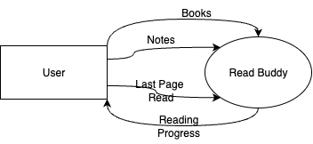
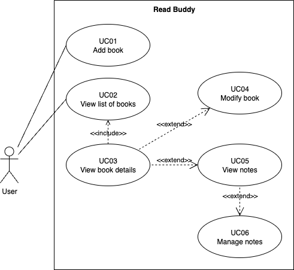
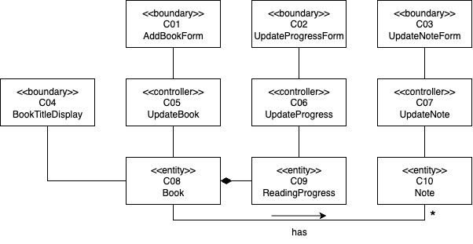

# Software Requirements Specification for Read Buddy

## 1\. Introduction

### 1.1 Purpose of the Document

This document is created to detail the requirements specification and provide a general description of the software named Read Buddy. Additionally, this document is intended to facilitate user understanding of the software. The contents of this document will also aid developers in the planning and development of the software.

### 1.2 Scope of the Problem

Read Buddy is a reading tracker application that makes it easy for users to log their reading activities. Read Buddy operates offline on a desktop platform without requiring authentication. Users can save data about books they want to read and are currently reading, and record the last page number read for each book. From this data, the program can display information such as the reading start date, the number of days since starting, and the number of times the book has been read. Users can also add personal notes to the pages of books saved in the program.

### 1.3 Definitions, Terms, and Abbreviations

| Abbreviation, Acronym, or Term | Explanation                                                                           |
| :----------------------------- | :------------------------------------------------------------------------------------ |
| S/W                            | Software                                                                              |
| SRS                            | Software Requirements Specification                                                   |
| DFD                            | Data Flow Diagram is a diagram that shows the flow of data.                           |
| ERD                            | Entity Relationship Diagram is a diagram that shows relationships between entities.   |
| STD                            | State Transition Diagram is a diagram that explains the dynamic behavior of a system. |
| OO                             | Object-Oriented is a term to describe the object-based programming paradigm.          |

### 1.4 Numbering Rules

| Item / Section             | Numbering | Description                      |
| :------------------------- | :-------- | :------------------------------- |
| Functional Requirement     | FXX       | XX starts from 01, then 02, etc. |
| Non-functional Requirement | NFXX      | XX starts from 01, then 02, etc. |
| Class Diagram              | CXX       | XX starts from 01, then 02, etc. |
| Use Case                   | UCXX      | XX starts from 01, then 02, etc. |

### 1.5 References

- IEEE. 1998. _IEEE Recommended Practice for Software Requirement Specification_. New York: IEEE Pressman, Roger S. 2001.
- _Software engineering: a practitioner's approach 5th ed_. New York: McGraw-Hill Companies, Inc.

### 1.6 Document Overview

This SRS document consists of five main sections: introduction, general system and software description, activity description, analysis model, and traceability.

- The **introduction** section contains the purpose of this document, the scope of the problem, definitions, terms, abbreviations, numbering rules used in this document, and references cited by the author.
- The **general system and software description** section contains a general description of the system and software, characteristics of the software users including categories, tasks, and access rights, as well as software constraints and operating environment.
- The **activity description** section contains explanations of functional requirements, non-functional requirements, and the use case model, which includes a use case diagram, actor definitions, use case definitions, and use case scenarios.
- The **analysis** section contains the identification of classes within the program and a class diagram illustrating the relationships between them.
- The **traceability** section contains tables showing the relationships between functional requirements, DFD processes, ERD, and related STDs.

---

## 2\. General System and Software Description

### 2.1 General System Description

Read Buddy is a desktop-based application that helps users track their reading. Users can input data about their books and reading progress.

Books that the user wants to read can be recorded in Read Buddy and marked as "To Read". When a book is being read, the user can mark it in Read Buddy, so it is recorded as "Reading" (or it can be added directly without going through the "To Read" status). Several pieces of information about a book are recorded, such as the book title, start reading date, number of days reading, number of times read, total pages of the book, and the last page number read. When finished, the book is recorded as "Read", so the user knows if they have read it before. A book that has been read ("Read") can also be re-read, changing its status again.

Users can also make personal notes on each page of every book they are currently reading. These personal notes can be edited and deleted. Users can also display a list of all personal notes for each book.

### 2.2 General Software Description

This software is specifically designed to provide a unique experience for its users in saving their reading progress. Available in a user-friendly desktop application format, it is easy for users from various backgrounds to use. With features for saving current progress, writing notes, and planning books to read, users can easily create a regular and organized reading experience.

### 2.3 Software User Characteristics

| User Category | Task                                      | Application Access Rights                                                                                                                                                                                                                         |
| :------------ | :---------------------------------------- | :------------------------------------------------------------------------------------------------------------------------------------------------------------------------------------------------------------------------------------------------ |
| User          | The user can save their reading progress. | - Add a new book   - Update book reading progress   - View the list, progress, and status of books   - Change book status from "To Read" to "Reading"   - Add or change notes for a book   - Correct the number of pages in a book |

### 2.4 Software Constraints

- The S/W can run on desktop operating systems, minimum Windows 10/macOS X/Ubuntu Linux version 12.
- The S/W can store metadata about the books inputted through the DBMS used and saved in a format that is independent of the operating system.
- The S/W can check the validity of user input (e.g., preventing negative inputs where they are not allowed).

### 2.5 Software Operating Environment

This application will function on a computer with the following minimum hardware specifications:

- **Processor:** Intel Celeron G550 @ 2.60 GHz or equivalent
- **RAM:** 2GB
- **Hard Disk Drive:** 200MB of free space
- **OS:** Minimum Windows 10/macOS X/Ubuntu Linux version 12

---

## 3\. Activity Description

### 3.1 Functional Requirements

| ID  | Requirement Statement                                     | Description                                                                                                                                                                                                                                                                                                                                                                                                                                                                                                               |
| :-- | :-------------------------------------------------------- | :------------------------------------------------------------------------------------------------------------------------------------------------------------------------------------------------------------------------------------------------------------------------------------------------------------------------------------------------------------------------------------------------------------------------------------------------------------------------------------------------------------------------ | --- |
| F01 | The software must allow users to add new book.            | The software allows users to add new books by entering the book title, number of pages, status, and whether it is a favorite. The system performs basic validation to ensure required fields are filled and page count is a positive integer.                                                                                                                                                                                                                                                                             |
| F02 | The software must allow users to view list of books.      | The user can view the list of books (with title, number of pages, status, reading start date and time, number of days since starting, number of times read, the last page read, and favorite status) stored in the software. The user can also view the number of books to be read, currently being read, and already read, including filtering by favorite status.                                                                                                                                                       |
| F03 | The software must allow users to view book details.       | The user can view the details of a book (with title, number of pages, status, reading start date and time, number of days since starting, number of times read, the last page read, and favorite status) stored in the software.                                                                                                                                                                                                                                                                                          |
| F04 | The software must allow users to modify book details.     | The user can modify the title, number of pages, status, and favorite status of a book. The user can change the status of a book from 'To Read' to 'Reading' and from 'Read' to 'Reading' when they want to re-read it. The book status also changes from 'Reading' to 'Read' automatically by the system when the last page read is equal to the book total page count. The date and time is recorded when the book status changed from 'To Read' to 'Reading'. The user can also delete a book regardless of its status. |
| F05 | The software must allow users to manage reading progress. | The user can update the last page number of the book they have read, and toggle the favorite status if applicable. The user can also update the reading start date and time, number of days since starting, and number of times read.                                                                                                                                                                                                                                                                                     |
| F06 | The software must allow users to view personal notes.     | The user can view and export the personal notes of a book (with note content, page number, and favorite status if integrated) to a Markdown file.                                                                                                                                                                                                                                                                                                                                                                         |     |
| F07 | The software must allow users to manage personal notes.   | The user can add, modify, and delete personal notes on each page of a book.                                                                                                                                                                                                                                                                                                                                                                                                                                               |
| F08 | The software must allow users to export personal notes.   | The user can export all personal notes for a book to a Markdown file, including note content and page numbers.                                                                                                                                                                                                                                                                                                                                                                                                            |

### 3.2 Non-Functional Requirements

| ID       | Parameter              | Requirement                                                                      |
| :------- | :--------------------- | :------------------------------------------------------------------------------- |
| NF01     | Portability            | Can only be accessed via desktop platforms (Windows, macOS, and Linux-based OS). |
| Others 1 | Communication Language | E.g., all interactions must be in Indonesian.                                    |

### 3.3 Use Case Model

#### 3.3.1 Use Case Diagram

As shown in the diagram, the user can perform actions as defined in the Software Requirements Specification (SRS). This use case diagram shows a "User" interacting with a system named "Read Buddy". The User can directly initiate two primary actions: "Add book" (UC01) and "View list of books" (UC02). The "View list of books" use case is connected to "View book details" (UC03) with an <\<include>> relationship, meaning that viewing the book details is a mandatory part of viewing the book list. From "View book details" (UC03), there are two optional pathways, represented by <\<extend>> relationships. The first is to "Modify book" (UC04), and the second is to "View notes" (UC05). Furthermore, the "View notes" (UC05) use case has its own optional extension, leading to "Manage notes" (UC06). This indicates that after a user decides to view notes, they then have the option to manage them.

#### 3.3.2 Actor Definitions

| No. | Actor | Description                                                                                                                                                |
| :-- | :---- | :--------------------------------------------------------------------------------------------------------------------------------------------------------- |
| 1   | User  | The user is the end-user of the reading tracker who can record books (to be read, reading, or read) and create personal notes on specific pages of a book. |

#### 3.3.3 Use Case Definitions

| ID   | Use Case           | Description                                                                                                                                                 |
| :--- | :----------------- | :---------------------------------------------------------------------------------------------------------------------------------------------------------- |
| UC01 | Add book           | The process of adding book data with input from the user, including setting an initial favorite status.                                                     |
| UC02 | View list of books | The system displays a list of books in the database along with their status, including options to filter or sort by favorite status.                        |
| UC03 | View book details  | The system displays book data, including favorite status, reading progress, and an option to export notes if notes are available.                           |
| UC04 | Modify book        | The process of changing book data, including favorite status, with user input and updating reading progress data.                                           |
| UC05 | View notes         | The system shows the notes available in the database and provides an option to export them to a Markdown file, potentially integrated with favorite status. |
| UC06 | Manage notes       | The process of adding or changing notes in the database with input from the user.                                                                           |

#### 3.3.4 Use Case Scenarios

**1. UC01 Add Book Scenario**

<table>
  <tr>
    <th>Actor Action</th>
    <th>System Reaction</th>
  </tr>
  <tr>
    <td colspan="2"><strong>Normal Scenario</strong></td>
  </tr>
  <tr>
    <td>1. User selects the "add book" menu.</td>
    <td></td>
  </tr>
  <tr>
    <td></td>
    <td>2. System displays a form for book data entry (book title, number of pages, book status: reading, to read).</td>
  </tr>
  <tr>
    <td>3. User fills in the book data.</td>
    <td></td>
  </tr>
  <tr>
    <td></td>
    <td>4. System adds the book data, including initializing favorite status to false, according to the input.</td>
  </tr>
  <tr>
    <td colspan="2"><strong>Alternative Scenario 1 (Incomplete data input)</strong></td>
  </tr>
  <tr>
    <td>1. User selects the "add book" menu.</td>
    <td></td>
  </tr>
  <tr>
    <td></td>
    <td>2. System displays a form for book data entry (book title, number of pages, book status: reading, to read).</td>
  </tr>
  <tr>
    <td>3. User fills in the book data but leaves one or more fields empty.</td>
    <td></td>
  </tr>
  <tr>
    <td></td>
    <td>4. System displays a pop-up with a message indicating that the book data is incomplete.</td>
  </tr>
  <tr>
    <td>5. User closes the pop-up.</td>
    <td></td>
  </tr>
  <tr>
    <td></td>
    <td>6. System returns to the previous menu.</td>
  </tr>
  <tr>
    <td colspan="2"><strong>Alternative Scenario 2 (Invalid page count)</strong></td>
  </tr>
  <tr>
    <td>1. User selects the "add book" menu.</td>
    <td></td>
  </tr>
  <tr>
    <td></td>
    <td>2. System displays a form for book data entry (book title, number of pages, book status: reading, to read).</td>
  </tr>
  <tr>
    <td>3. User fills in the book data but enters a non-numeric or negative value for page count.</td>
    <td></td>
  </tr>
  <tr>
    <td></td>
    <td>4. System displays an error message indicating that page count must be a positive integer.</td>
  </tr>
  <tr>
    <td>5. User corrects the page count or closes the form.</td>
    <td></td>
  </tr>
  <tr>
    <td></td>
    <td>6. System returns to the form for correction or the previous menu.</td>
  </tr>
</table>

**2. UC02 View List of Books Scenario**

<table>
  <tr>
    <th>Actor Action</th>
    <th>System Reaction</th>
  </tr>
  <tr>
    <td colspan="2"><strong>Normal Scenario</strong></td>
  </tr>
  <tr>
    <td>1. User opens the application.</td>
    <td></td>
  </tr>
  <tr>
    <td></td>
    <td>2. System displays a list of book titles along with their statuses ('reading', 'read', and 'to read').</td>
  </tr>
</table>

**3. UC03 View Book Details Scenario**

<table>
  <tr>
    <th>Actor Action</th>
    <th>System Reaction</th>
  </tr>
  <tr>
    <td colspan="2"><strong>Normal Scenario</strong></td>
  </tr>
  <tr>
    <td>1. User selects a book from the list.</td>
    <td></td>
  </tr>
  <tr>
    <td></td>
    <td>2. System displays the book's data, including favorite status, and reading progress, along with a form to update the progress (last page read) and toggle favorite status.</td>
  </tr>
</table>

**4. UC04 Modify Book Scenario**

<table>
  <tr>
    <th>Actor Action</th>
    <th>System Reaction</th>
  </tr>
  <tr>
    <td colspan="2"><strong>Normal Scenario</strong></td>
  </tr>
  <tr>
    <td>1. User selects a book from the list.</td>
    <td></td>
  </tr>
  <tr>
    <td></td>
    <td>2. System displays the book's data and reading progress, along with a form to update the progress (last page read).</td>
  </tr>
  <tr>
    <td>3. User clicks the "update" button.</td>
    <td></td>
  </tr>
  <tr>
    <td></td>
    <td>4. System displays a form for updating the book data (title, number of pages, status).</td>
  </tr>
  <tr>
    <td>5. User fills in the book data.</td>
    <td></td>
  </tr>
  <tr>
    <td></td>
    <td>6. System updates the book data, including any changes to favorite status, according to the user's input.</td>
  </tr>
</table>

**5. UC05 View Notes Scenario**

<table>
  <tr>
    <th>Actor Action</th>
    <th>System Reaction</th>
  </tr>
  <tr>
    <td colspan="2"><strong>Normal Scenario</strong></td>
  </tr>
  <tr>
    <td>1. User selects a book from the list.</td>
    <td></td>
  </tr>
  <tr>
    <td></td>
    <td>2. System displays the book's data and reading progress, along with a form to update the progress (last page read).</td>
  </tr>
  <tr>
    <td>3. User selects the "view notes" menu.</td>
    <td></td>
  </tr>
  <tr>
    <td></td>
    <td>4. System displays the notes for the selected book.</td>
  </tr>
</table>

**6. UC06 Manage Notes Scenario**

<table>
  <tr>
    <th>Actor Action</th>
    <th>System Reaction</th>
  </tr>
  <tr>
    <td colspan="2"><strong>Normal Scenario</strong></td>
  </tr>
  <tr>
    <td>1. User selects a book from the list.</td>
    <td></td>
  </tr>
  <tr>
    <td></td>
    <td>2. System displays the book's data and reading progress, along with a form to update the progress (last page read).</td>
  </tr>
  <tr>
    <td>3. User selects the "view notes" menu.</td>
    <td></td>
  </tr>
  <tr>
    <td></td>
    <td>4. System displays the notes for the selected book.</td>
  </tr>
  <tr>
    <td>5. User selects the "add note" or "modify note" or "delete note" button.</td>
    <td></td>
  </tr>
  <tr>
    <td></td>
    <td>6. System displays a form for adding or modifying notes (empty if adding).</td>
  </tr>
  <tr>
    <td>7. User fills in the note data.</td>
    <td></td>
  </tr>
  <tr>
    <td></td>
    <td>8. System adds the note data according to the user's input.</td>
  </tr>
</table>

---

## 4. Analysis Model

### 4.1 Class Identification

| No. | Class Name         | Type (Boundary, Controller, Entity) |
| :-- | :----------------- | :---------------------------------- |
| 1   | AddBookForm        | boundary                            |
| 2   | UpdateProgressForm | boundary                            |
| 3   | UpdateNoteForm     | boundary                            |
| 4   | BookTitleDisplay   | boundary                            |
| 5   | UpdateBook         | controller                          |
| 6   | UpdateProgress     | controller                          |
| 7   | UpdateNote         | controller                          |
| 8   | Book               | entity                              |
| 9   | ReadingProgress    | entity                              |
| 10  | Note               | entity                              |

### 4.2 Class Diagram

This class diagram illustrates the relationships between different components, categorized by stereotypes: <\<boundary>> for user interface elements, <\<controller>> for logic handlers, and <\<entity>> for data models. The diagram shows three main workflows.

First, the "AddBookForm" (C01), a boundary class, interacts with the "UpdateBook" controller (C05). This controller, in turn, manages the "Book" entity (C08).

Second, the "UpdateProgressForm" (C02), another boundary class, communicates with the "UpdateProgress" controller (C06). This controller is responsible for handling the "ReadingProgress" entity (C09).

Third, the "UpdateNoteForm" (C03) boundary class works with the "UpdateNote" controller (C07), which manages the "Note" entity (C10).

Regarding the relationships between the entities themselves: The "Book" entity (C08) has a composition relationship with the "ReadingProgress" entity (C09), indicated by a filled diamond pointing from "Book" to "ReadingProgress". This means a "ReadingProgress" is part of a "Book".

Furthermore, there is an association between the "Book" entity (C08) and the "Note" entity (C10), labeled with "has". An arrow points from "Book" to "Note", and a multiplicity of \* (many) is shown on the "Note" end, signifying that a single "Book" can have multiple "Notes".

Finally, there is a "BookTitleDisplay" boundary class (C04) which has a direct association with the "Book" entity (C08), suggesting it displays information directly from the book data.

**Class Details**

| Class ID | Class Name         | Attributes                                                                                                                            | Methods                                                                                                                                                               |
| :------- | :----------------- | :------------------------------------------------------------------------------------------------------------------------------------ | :-------------------------------------------------------------------------------------------------------------------------------------------------------------------- |
| C01      | AddBookForm        | `input_book_title`, `input_page_count`, `input_book_status`                                                                           | `display_add_book_form()`                                                                                                                                             |
| C02      | UpdateProgressForm | `book_id`, `input_book_title`, `input_page_count`, `input_book_status`, `input_start_date`, `input_day_counter`, `input_current_page` | `display_update_progress_form()`                                                                                                                                      |
| C03      | UpdateNoteForm     | `input_book_title`, `input_note_content`, `input_note_page`                                                                           | `display_update_note_form()`                                                                                                                                          |
| C04      | BookTitleDisplay   | `book_id`, `book_title`, `book_status`                                                                                                | `display_book_list()`                                                                                                                                                 |
| C05      | UpdateBook         | `book_id`, `new_book_title`, `new_page_count`, `new_book_status`                                                                      | `update_book_data()`                                                                                                                                                  |
| C06      | UpdateProgress     | `target_book_id`, `start_date`, `day_counter`, `current_page`, `read_count`                                                           | `update_reading_progress()`                                                                                                                                           |
| C07      | UpdateNote         | `book_id`, `note_id`, `note_content`, `page_number`                                                                                   | `update_note()`                                                                                                                                                       |
| C08      | Book               | `book_id`, `book_title`, `page_count`, `book_status`, `is_favorite`                                                                   | `get_title()`, `get_pages()`, `get_status()`, `get_book_id()`, `set_title()`, `set_pages()`, `set_status()`, `get_is_favorite()`, `set_is_favorite()`                 |
| C09      | ReadingProgress    | `book_id`, `start_date`, `day_counter`, `current_page`, `read_count`                                                                  | `get_book_id()`, `get_start_date()`, `set_start_date()`, `get_day()`, `set_day()`, `get_current_page()`, `set_current_page()`, `get_read_count()`, `set_read_count()` |
| C10      | Note               | `book_id`, `note_id`, `note_content`, `note_page`                                                                                     | `get_note_content()`, `get_note_page()`, `get_note_id()`, `set_note_content()`, `set_note_page()`                                                                     |

---

## 5. Traceability

### 5.1 Functional Requirements vs. Use Case

| Functional Requirement ID | Related Use Case ID |
| :------------------------ | :------------------ |
| F01                       | UC01                |
| F02                       | UC02                |
| F03                       | UC03                |
| F04                       | UC04                |
| F05                       | UC04                |
| F06                       | UC05                |
| F07                       | UC06                |

### 5.2 Use Case vs. Related Classes

| Use Case ID | Related Classes                                                                                            |
| :---------- | :--------------------------------------------------------------------------------------------------------- |
| UC01        | C01 AddBookForm, C05 UpdateBook, C08 Book                                                                  |
| UC02        | C04 BookTitleDisplay, C08 Book                                                                             |
| UC03        | C04 BookTitleDisplay, C05 UpdateBook, C06 UpdateProgress, C08 Book, C09 ReadingProgress                    |
| UC04        | C01 AddBookForm, C02 UpdateProgressForm, C05 UpdateBook, C06 UpdateProgress, C08 Book, C09 ReadingProgress |
| UC05        | C07 UpdateNote, C08 Book, C09 ReadingProgress                                                              |
| UC06        | C03 UpdateNoteForm, C07 UpdateNote, C10 Note                                                               |
